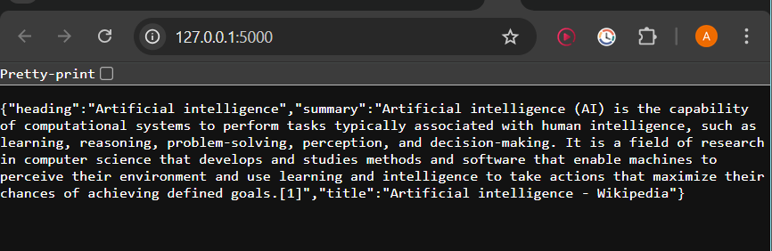

#Output




 # DevOps Assignment – Web Scraper with Docker

 # Overview

This project demonstrates a simple containerized application that combines **Node.js** and **Python** using a **multi-stage Docker build**.

The application performs two main tasks:

1. **Scrapes a webpage** using Node.js with Puppeteer and a headless Chromium browser.
2. **Hosts the scraped data** using a Python Flask server that returns the result as JSON.

---


## Technologies Used

* **Docker**
* **Node.js**
* **Puppeteer**
* **Chromium**
* **Python**
* **Flask**
* **JSON**

---

## Prerequisites

Make sure the following tools are installed:

* Docker
* Node.js (optional for local testing)
* Python 3 (optional for local testing)

Check installation:

```
docker --version
node --version
python --version
```

---

## Build the Docker Image

```
docker build --build-arg SCRAPE_URL=https://en.wikipedia.org/wiki/Artificial_intelligence -t devops-assignment .

```


## Running the Container


```
docker run -p 5000:5000 devops-assignment
```


---

## Additional Endpoints

Health check endpoint:

```
http://localhost:5000/health
```

Response:

```
{
  "status": "running"
}
```

---
